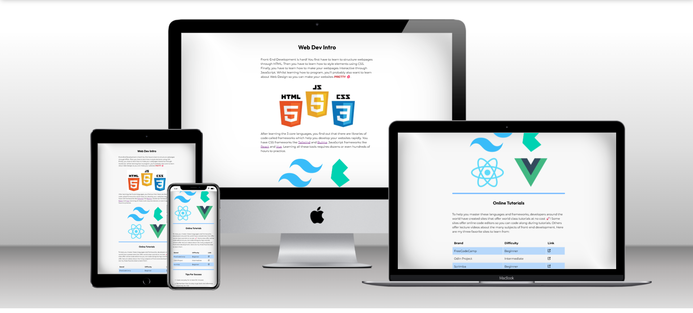
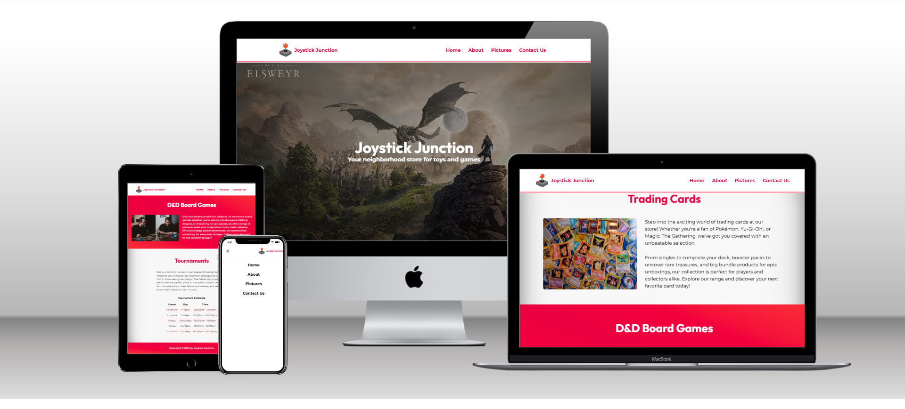
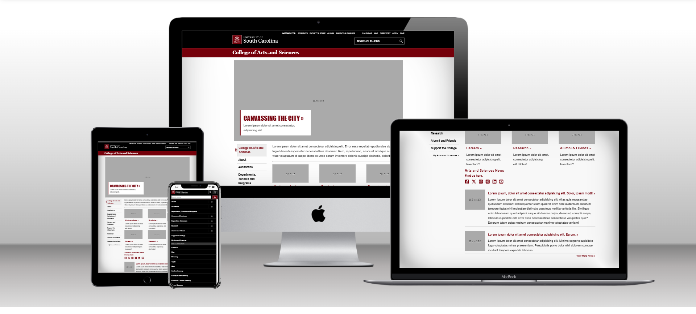
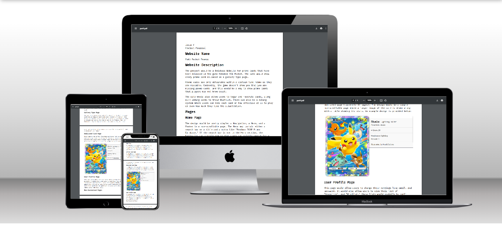

# not-josue.github.io

## CSCE 242

This is a collection of my projects for CSCE 242 - Web Applications at the University of South Carolina.

[Home](https://not-josue.github.io/csce242/)

### Assignments

1. [Assignment 01](https://not-josue.github.io/csce242/assignments/assignment01/index.html) - Basic HTML

2. [Assignment 02](https://not-josue.github.io/csce242/assignments/assignment02/index.html) - Basic CSS

3. [Assignment 03](https://not-josue.github.io/csce242/assignments/assignment03/index.html) - Page Layout

4. [Assignment 04](https://not-josue.github.io/csce242/assignments/assignment04/index.html) - Recreate CSS Page

### Projects

1. [Part 01](https://not-josue.github.io/csce242/projects/part1/part1.pdf) - Topic Selection

