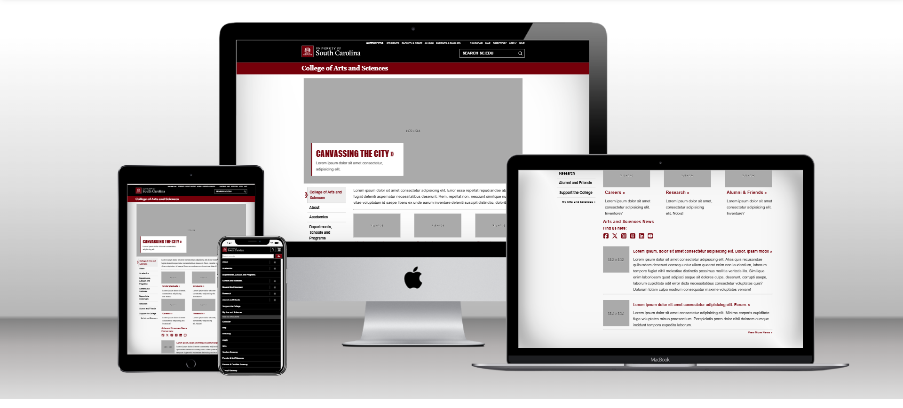

# CSCE 242 Web Applications

## Course Description

Firstly, students will learn the fundamentals of front-end web development by learning to structure their websites with HTML, style their websites through CSS, and add interactivity to their websites using JavaScript. Lastly, they will learn back-end development by learning NodeJS and MongoDB.

🌐 [Home](https://not-josue.github.io/csce242/)

## Assignments

1. [Assignment 01](https://not-josue.github.io/csce242/assignments/assignment01/index.html) - Basic HTML

2. [Assignment 02](https://not-josue.github.io/csce242/assignments/assignment02/index.html) - Basic CSS

3. [Assignment 03](https://not-josue.github.io/csce242/assignments/assignment03/index.html) - Page Layout

4. [Assignment 04](https://not-josue.github.io/csce242/assignments/assignment04/index.html) - Recreate CSS Page

## Projects

1. [Part 01](https://not-josue.github.io/csce242/projects/part1/part1.pdf) - Topic Selection

2. [Part 02](https://not-josue.github.io/csce242/projects/part2/index.html) - Wireframe

