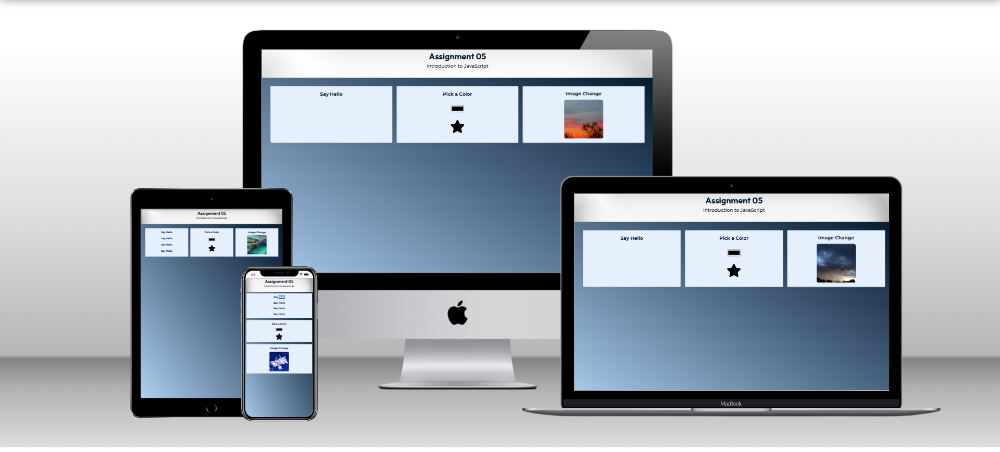

# CSCE 242 Web Applications

## Course Description

Firstly, students will learn the fundamentals of front-end web development by learning to structure their websites with HTML, style their websites through CSS, and add interactivity to their websites using JavaScript. Lastly, they will learn back-end development by learning NodeJS and MongoDB.

🌐 [Home](https://not-josue.github.io/csce242/)

## Assignments

🌐 [Assignment 01 - Basic HTML](https://not-josue.github.io/csce242/assignments/assignment01/index.html)

Using basic HTML elements like headers, paragraphs, images, a list, a table, and external links.

🌐 [Assignment 02 - Basic CSS](https://not-josue.github.io/csce242/assignments/assignment02/index.html)

Building a navigation bar, and other HTML elements and giving them proper styling with CSS.

🌐 [Assignment 03 - Page Layout](https://not-josue.github.io/csce242/assignments/assignment03/index.html)

Showing how you can use flexbox to create a clean layout for your webpage.

🌐 [Assignment 04 - Recreate CSS Page](https://not-josue.github.io/csce242/assignments/assignment04/index.html)

Recreating a page from the University of South Carolina's website.

🌐 [Assignment 05 - Basic JS](https://not-josue.github.io/csce242/assignments/assignment05/index.html)

Using basic event handlers to show interactivity with elements.

🌐 [Assignment 06 - Conditionals](https://not-josue.github.io/csce242/assignments/assignment06/index.html)

Displaying content based on user input and tab selection.

🌐 [Assignment 07 - Loops](https://not-josue.github.io/csce242/assignments/assignment07/index.html)

Using loops to generate elements and run functions multiple times.

🌐 [Assignment 08 - Arrays](https://not-josue.github.io/csce242/assignments/assignment08/index.html)

Structuring arrays to help display interactive data in a modal.

🌐 [Assignment 09 - Classes](https://not-josue.github.io/csce242/assignments/assignment09/index.html)

Creating a class to display a gallery of similar items and modals.

## Projects

🌐 [Part 01 - Topic Selection](https://not-josue.github.io/csce242/projects/part1/part1.pdf)

A description of each page in the project and its features.

🌐 [Part 02 - Wireframe](https://not-josue.github.io/csce242/projects/part2/index.html)

A wireframe to show the basic layout and user flow.

🌐 [Part 03 - HTML & CSS](https://not-josue.github.io/csce242/projects/part3/index.html)

The HTML & CSS of each page shown in the wireframe.

🌐 [Part 04 - Images](https://not-josue.github.io/csce242/projects/part4/index.html)

The website with all images, text, & color scheme.

🌐 [Part 05 - JavaScript](https://not-josue.github.io/csce242/projects/part5/index.html)

Intermediate JavaScript to fetch data & sort the gallery page.

🌐 [Part 06 - Data Update](https://not-josue.github.io/csce242/projects/part6/index.html)

Updating JSON data and sorting features with newly released cards.

🌐 [Part 07 - Contact Form & iFrame](https://not-josue.github.io/csce242/projects/part7/index.html)

Updating JSON data and sorting features with newly released cards.

🌐 [Part 08 - React](https://not-josue.github.io/poke-pocket-promos/)

Migrating the application to React. Interactivity features not enabled.

🌐 [Part 09 - Backend](https://github.com/not-josue/poke-pocket-promos-backend)

Separating data from the frontend by creating an API to fetch from.

